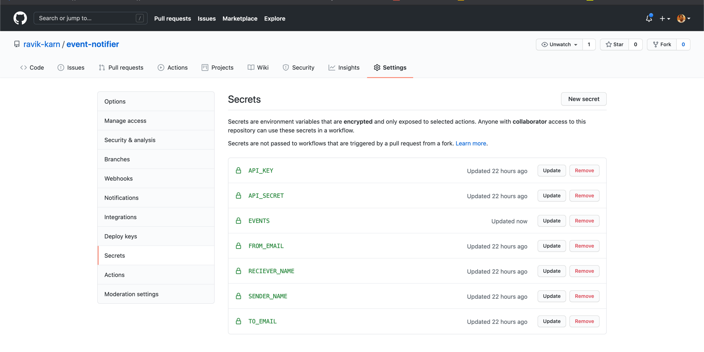

# Event Notifier

Features: Sends event notification every day at 0AM UTC

## Setup
- Create mailjet account - [here](https://app.mailjet.com/signin)
- Set following env vars in github secrets
  - API_KEY - Mailjet API key
  - API_SECRET - Mailjet API secret
  - FROM_EMAIL - Sender email
  - TO_EMAIL - Reciever email
  - SENDER_NAME - Sender name
  - RECIEVER_NAME - Reciever name
  - EVENTS - Json of events - [Sample](src/resources/events.json)

  
